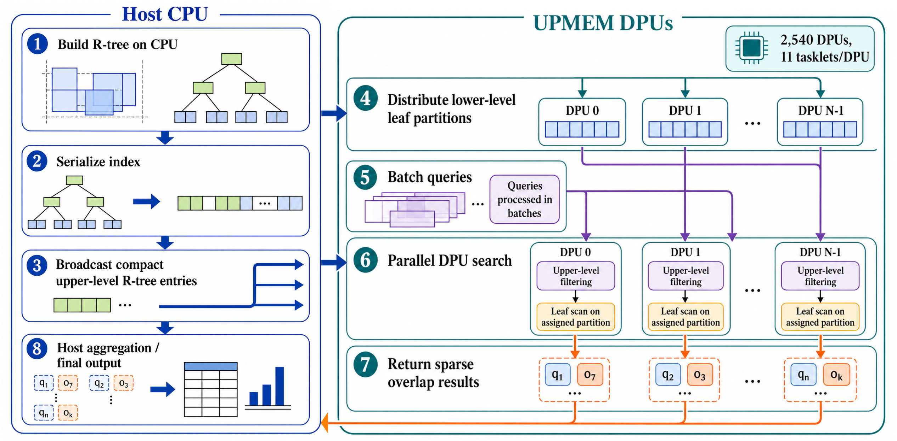

# Scaling R-tree Spatial Search on Processing-in-Memory

This repository accompanies the HPDC 2026 poster **“Challenges in Scaling R-tree Spatial Search on Processing-in-Memory.”** It studies how an irregular, output-sensitive R-tree range-search workload behaves on a commercial **UPMEM Processing-in-Memory (PIM)** system.

The work extends our ISC 2026 paper, **“Parallel R-tree-based Spatial Query Processing on a Commercial Processing-in-Memory System,”** which introduced the broadcast-based CPU-DPU R-tree design used here. The HPDC extension keeps the same core methodology and focuses on the system-level challenges that appear when the design is scaled across datasets, query volumes, and DPU counts: workload imbalance, host-DPU communication, result movement, and CPU-side aggregation.

## Repository contents

- [`HPDC_poster.pdf`](HPDC_poster.pdf) - HPDC 2026 poster on scaling challenges and full-pipeline behavior.
- [`ISC_paper.pdf`](ISC_paper.pdf) - ISC 2026 paper describing the original broadcast-based R-tree methodology, implementation, and evaluation.

> **Note:** This repository currently contains the research artifacts above. Source code and datasets are not included in this snapshot.

---

## Why this work matters

Spatial systems repeatedly evaluate questions such as:

- Which buildings overlap a geographic region?
- Which lakes intersect an area of interest?
- Which mapped objects fall inside or intersect a query window?

An R-tree reduces the number of spatial objects that must be examined by organizing them in a hierarchy of **minimum bounding rectangles (MBRs)**. However, an R-tree search is not a regular scan. The nodes visited by a query depend on the query location, size, selectivity, and overlap among tree regions. This creates irregular memory accesses, branch divergence, variable output sizes, and uneven work.

<p align="center">
  
</p>
<p align="center"><em>Different query rectangles visit different branches and produce different amounts of work.</em></p>

On a conventional CPU, these searches repeatedly move R-tree nodes and object records through the memory hierarchy. This work investigates whether PIM can reduce that movement by executing rectangle-overlap tests close to DRAM, while also identifying the remaining bottlenecks in the complete CPU-DPU pipeline.

---

## Relationship to GIS

This project is directly related to **Geographic Information Systems (GIS)** and spatial databases. GIS datasets commonly contain points, polylines, and polygons representing real-world features such as buildings, lakes, roads, parcels, and sports facilities. Spatial systems use R-trees and related indexes to accelerate:

- map-viewport and window queries;
- spatial filtering and intersection search;
- spatial joins and overlay processing;
- subset extraction and download; and
- candidate generation before exact geometry tests.

<p align="center">
  
</p>
<p align="center"><em>GIS objects are represented by MBRs and indexed hierarchically by an R-tree.</em></p>

For indexing, a complex feature is represented by its axis-aligned MBR. During a query, the R-tree prunes branches whose MBRs do not intersect the query rectangle. The present implementation accelerates this fundamental GIS filtering operation and returns overlap counts. In a complete GIS pipeline, the candidate objects can subsequently be checked with an exact polygon or polyline predicate.

The real datasets are obtained from the **UCR Spatio-temporal Active Repository (UCR-STAR)**, a public repository for large spatial datasets. UCR-STAR supports interactive map visualization, rectangular range retrieval, and spatial subset download using spatial indexes from the R-tree family [6]. This makes the evaluated operation directly representative of a core service used by spatial repositories and GIS back ends.

---

## Dataset representation and query workloads

Every indexed object and every query is represented as a two-dimensional axis-aligned rectangle:

```text
(xmin, ymin, xmax, ymax)
```

- `xmin`, `xmax`: minimum and maximum horizontal coordinates;
- `ymin`, `ymax`: minimum and maximum vertical coordinates.

### What each indexed rectangle represents

An indexed rectangle is the MBR of one source spatial feature:

| Dataset | Indexed rectangles | Meaning of one rectangle |
|---|---:|---|
| Sports | 1.7 million | MBR of one sports-related geospatial feature |
| Lakes | 8.4 million | MBR of one lake or water-body geometry |
| Buildings | 14.3 million | MBR of one building footprint |

The exact original geometry may be a polygon or another spatial feature. The rectangle stored in the R-tree is its bounding box, which is used for fast candidate filtering.

### What a query rectangle represents

A query rectangle is a spatial search window. For each query, the program counts how many indexed rectangles intersect that window. Because leaf nodes are distributed across DPUs, each DPU computes a partial count and the host sums the partial counts to obtain the final result.

Two rectangles overlap unless one is completely to the left, right, above, or below the other.

### Why query rectangles are sampled from the dataset

The experiments use approximately **1%, 5%, 10%, and 25%** of each dataset as query rectangles. Sampling queries from the same dataset provides realistic query shapes, sizes, coordinate ranges, and spatial distributions without inventing arbitrary synthetic windows. It also gives a controlled and reproducible way to increase query pressure.

The percentages fix only the **number of input queries**. They do **not** fix the number of returned overlaps. A query in a dense region may intersect many indexed objects, while a query in a sparse region may intersect only a few. Therefore, output cardinality remains data-dependent and the workload remains output-sensitive.

A sampled rectangle may intersect its corresponding indexed object, which guarantees a valid non-empty query, but the total result size is still not fixed because all additional intersections depend on local spatial density and geometry overlap. The same query sets and overlap semantics are used for CPU and PIM execution, preserving a fair comparison.

Coordinates are converted to fixed-precision 32-bit integers for DPU execution because the evaluated UPMEM DPUs are not optimized for floating-point-heavy processing.

---

## Processing-in-Memory architecture

### PIM concept

In a conventional von Neumann system, the CPU or GPU repeatedly transfers data to and from DRAM. For data-intensive workloads, this movement can dominate both runtime and energy. Processing-in-Memory moves lightweight computation closer to memory so that more operations are performed where the data reside.

<p align="center">
  
</p>
<p align="center"><em>Conceptual difference between processor-centric execution and Processing-in-Memory.</em></p>

### Server-level organization

The evaluated UPMEM server contains conventional DRAM DIMMs and PIM-enabled DIMMs attached to two host CPU sockets. A PIM-enabled DIMM contains multiple PIM chips, and each PIM chip contains multiple lightweight DRAM Processing Units (DPUs).

<table>
  <tr>
    <td align="center" width="50%">
      
      <br>
      <em>Host CPUs orchestrate execution while PIM chips provide many near-memory DPUs.</em>
    </td>
    <td align="center" width="50%">
      
      <br>
      <em>Physical placement of conventional DRAM and PIM-enabled memory in the dual-socket server.</em>
    </td>
  </tr>
</table>

The evaluated hierarchy is:

```text
Host CPU sockets
  |
  +-- Conventional DRAM DIMMs
  |
  +-- UPMEM PIM DIMMs
        |
        +-- 16 PIM chips per DIMM
              |
              +-- 8 DPUs per chip
                    |
                    +-- one 64 MB MRAM bank per DPU
```

A PIM DIMM therefore provides **128 DPUs and 8 GB of PIM memory**. A 20-DIMM configuration provides a nominal total of **2,560 DPUs and 160 GB**. The experiments use up to **2,540 DPUs**, the maximum stable allocation on the evaluated system.


### Memory hierarchy inside each DPU

Each DPU contains three important memory regions:

| Memory | Capacity | Role in this project |
|---|---:|---|
| **MRAM** | 64 MB | DPU-local DRAM storing serialized leaf nodes, query batches, upper-level metadata before loading, and result buffers |
| **WRAM** | 64 KB | Fast shared scratchpad for upper-level R-tree headers, counters, control metadata, and intermediate state |
| **IRAM** | 24 KB | Instruction memory containing the DPU kernel code |

Each DPU is a lightweight in-order processor running at approximately **400 MHz** and supports multiple hardware threads called **tasklets**. The implementation uses **11 tasklets per DPU**, because performance saturates beyond that point for the studied workload.

### CPU-DPU execution model

A DPU directly accesses only its own local memory. DPUs do not communicate directly with one another, so the host CPU must orchestrate the full pipeline:

1. build and serialize the R-tree;
2. place tree partitions and query batches in DPU MRAM;
3. launch the DPU kernels;
4. retrieve partial results; and
5. aggregate the per-DPU counts.

This bulk-synchronous model rewards applications that maximize DPU-local work, reuse data across query batches, and minimize host-mediated data movement.

## Hardware Constraints of Commercial PIM

UPMEM PIM reduces CPU–DRAM data movement by executing computation near memory. However, applications must be redesigned around several hardware constraints.

### Small WRAM capacity

Each DPU provides only 64 KB of WRAM, shared by all tasklets. A complete pointer-based R-tree cannot fit in this memory.

**Design response:** Store only compact upper-level metadata in WRAM and keep the larger leaf partitions in MRAM.

### Explicit MRAM–WRAM transfers

MRAM is much larger than WRAM but has higher access cost. Data movement between MRAM and WRAM must be explicitly managed, and small irregular accesses can be inefficient.

**Design response:** Serialize nodes contiguously and use sequential MRAM accesses where possible.

### No direct inter-DPU communication

DPUs cannot exchange data or partial results directly.

**Design response:** Each DPU processes its local partition independently and returns partial results to the host CPU for final aggregation.

### Host–DPU communication overhead

Data placement, query transfer, kernel launch, result retrieval, and synchronization are controlled by the host. A fast DPU kernel therefore does not necessarily provide fast end-to-end execution.

**Design response:** Use broadcasts, parallel transfers, and batched query execution to amortize communication overhead.

### Lightweight DPU cores

DPUs are designed for simple, memory-intensive operations rather than compute-heavy workloads or high floating-point throughput.

**Design response:** Coordinates are represented using 32-bit integers, and the kernel performs simple rectangle-overlap tests.

### Pointer and allocation restrictions

Host pointers are not valid on DPUs, and conventional pointer-rich data structures cannot be transferred directly.

**Design response:** Serialize the R-tree into a flat breadth-first array and replace pointers with array indices.

These constraints are consistent with prior studies of commercial UPMEM systems [2], [3].

---
## Methodology

This HPDC work uses the **same Broadcast PIM R-tree methodology introduced in the ISC 2026 paper** [1].

In summary:

1. The CPU builds a three-level STR R-tree.
2. The tree is serialized in breadth-first order.
3. Compact upper-level headers are broadcast to all DPUs.
4. Contiguous leaf partitions are distributed across DPU-local MRAM.
5. Query rectangles are broadcast in batches.
6. DPUs process queries in parallel using multiple tasklets.
7. Partial overlap counts are returned to the host and aggregated.

For full implementation details, including R-tree construction, serialization, data placement, query batching, and DPU execution, see the accompanying ISC paper:

**Parallel R-tree-based Spatial Query Processing on a Commercial Processing-in-Memory System** [1].

<p align="center">
  
</p>

<p align="center">
  <em>
    Broadcast PIM R-tree workflow: the host builds and serializes the index, distributes tree data and batched queries, while UPMEM DPUs perform parallel filtering and local leaf searches before returning partial results for host aggregation.
  </em>
</p>

### Query workloads

For each dataset, approximately 1%, 5%, 10%, and 25% of the dataset rectangles are used as query rectangles.

This approach preserves the dataset's spatial distribution, coordinate range, and rectangle dimensions. The percentages control the **number of queries**, not the number of returned results.

The output size remains data-dependent because different query rectangles may overlap different numbers of indexed objects.

---

## ISC paper versus HPDC extension

| Aspect | ISC 2026 paper | HPDC 2026 extension |
|---|---|---|
| Main goal | Introduce the first broadcast-based R-tree range-search implementation on commercial UPMEM PIM | Analyze why scaling the same design is difficult at the full-system level |
| Core method | CPU-built STR R-tree, BFS serialization, upper-level broadcast, distributed leaf partitions, batched DPU search | Same methodology |
| Main comparison | Broadcast-based PIM R-tree versus subtree-based PIM baseline and CPU baselines | Kernel versus end-to-end behavior across datasets, query volumes, and DPU counts |
| Primary findings | Broadcast avoids communication-dominated subtree transfer and enables scalable, energy-efficient search | DPU search scales well, but host aggregation, result movement, and query-induced imbalance limit end-to-end scaling |
| Additional dataset emphasis | Sports, Lakes, and synthetic rectangles | Sports, Lakes, and Buildings |
| New analysis | Performance, scalability, communication, and energy | Per-DPU cycle/hit imbalance, DPU-count scaling, and detailed pipeline breakdown |

---

## Selected HPDC results

Using 2,540 DPUs and 11 tasklets per DPU:

| Dataset | Query workload | CPU search | DPU kernel | Total PIM pipeline | Kernel speedup | End-to-end speedup |
|---|---:|---:|---:|---:|---:|---:|
| Sports | 25% | 23.60 s | 1.14 s | 6.14 s | 20.67x | 3.84x |
| Lakes | 25% | 316.25 s | 7.50 s | 28.01 s | 42.19x | 11.29x |
| Buildings | 25% | 114.65 s | 1.58 s | 35.89 s | 72.59x | 3.19x |

Key observations:

- DPU-side kernel speedup ranges from approximately **20x to 73x**.
- End-to-end speedup ranges from **0.87x to 11.29x**, depending on the dataset and query volume.
- Increasing the number of DPUs strongly improves kernel time, but end-to-end improvement eventually saturates.
- Sequential CPU-side aggregation becomes dominant for output-heavy workloads.
- Spatial skew creates hot DPU-owned regions even when the leaf nodes are evenly partitioned.

---

## Current limitations and future work

The current system exposes several opportunities for improvement:

1. **Parallel host aggregation** - replace sequential reduction with a multithreaded or vectorized host implementation.
2. **DPU-side partial reduction** - reduce the amount of result data returned to the CPU.
3. **Query-aware partitioning** - partition or schedule work using both data distribution and query frequency.
4. **Hot-region replication** - replicate frequently accessed spatial regions across several DPUs.
5. **Adaptive batching** - choose batch sizes based on output selectivity and communication cost.
6. **Exact geometry refinement** - extend the pipeline beyond MBR filtering to full GIS predicates where appropriate.
7. **Deeper-tree support** - develop hierarchical layouts that remain efficient when additional internal levels no longer fit in WRAM.

---

## How to cite

### ISC 2026 paper

```bibtex
@inproceedings{jannat2026parallel,
  title     = {Parallel R-tree-based Spatial Query Processing on a Commercial Processing-in-Memory System},
  author    = {Jannat, Tasmia and Gowanlock, Michael and Puri, Satish},
  booktitle = {International Supercomputing Conference (ISC)},
  year      = {2026}
}
```

Preprint: https://arxiv.org/abs/2604.14445

### HPDC 2026 poster

```bibtex
@inproceedings{jannat2026challenges,
  title     = {Challenges in Scaling R-tree Spatial Search on Processing-in-Memory},
  author    = {Jannat, Tasmia and Gowanlock, Michael and Puri, Satish},
  booktitle = {Proceedings of the International Symposium on High-Performance Parallel and Distributed Computing (HPDC)},
  year      = {2026},
  note      = {Research poster}
}
```

---

## References

1. T. Jannat, M. Gowanlock, and S. Puri, “Parallel R-tree-based Spatial Query Processing on a Commercial Processing-in-Memory System,” ISC 2026; arXiv:2604.14445. https://arxiv.org/abs/2604.14445
2. J. Gómez-Luna, I. El Hajj, I. Fernandez, C. Giannoula, G. F. Oliveira, and O. Mutlu, “Benchmarking a New Paradigm: Experimental Analysis and Characterization of a Real Processing-in-Memory System,” *IEEE Access*, vol. 10, 2022. https://doi.org/10.1109/ACCESS.2022.3174101
3. I. El Hajj et al., “PrIM: A Benchmark Suite for Processing-in-Memory,” *IEEE Transactions on Parallel and Distributed Systems*, vol. 32, no. 12, 2021. https://doi.org/10.1109/TPDS.2021.3085791
4. A. Guttman, “R-trees: A Dynamic Index Structure for Spatial Searching,” *Proceedings of ACM SIGMOD*, 1984. https://doi.org/10.1145/971697.602266
5. S. T. Leutenegger, M. A. Lopez, and J. Edgington, “STR: A Simple and Efficient Algorithm for R-tree Packing,” *Proceedings of ICDE*, 1997. https://doi.org/10.1109/ICDE.1997.582015
6. S. Ghosh, T. Vu, M. A. Eskandari, and A. Eldawy, “UCR-STAR: The UCR Spatio-Temporal Active Repository,” *SIGSPATIAL Special*, vol. 11, no. 2, 2019. https://doi.org/10.1145/3377000.3377005
7. UCR-STAR spatial dataset repository. https://star.cs.ucr.edu/

---

## Authors

- **Tasmia Jannat**, Missouri University of Science and Technology
- **Michael Gowanlock**, Northern Arizona University
- **Satish Puri**, Missouri University of Science and Technology

## Acknowledgments

This work is supported in part by the National Science Foundation grants acknowledged in the accompanying paper and poster.

